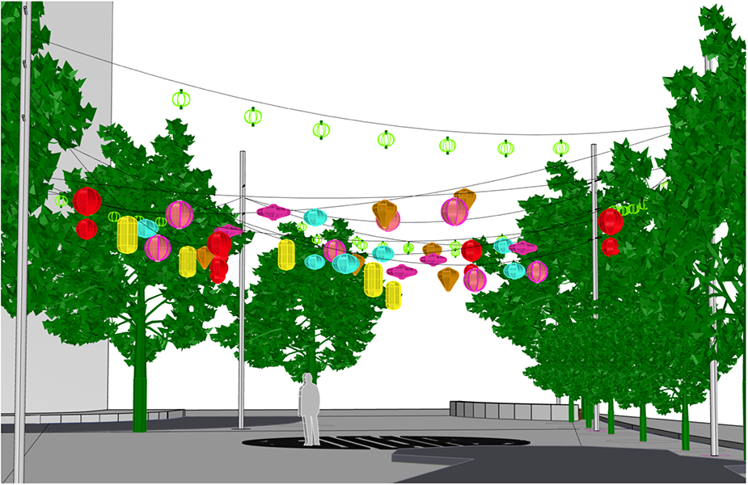

# Chinatown Park Lantern

This project evaluates cables and fixures (lanterns) loading on lightpoles and their foundations at Boston Chinatown Park with a list of analysis assumptions.

## Instructions (Wind Load Calculation)

Step 1: Open the file `src/Wind Loads on Solid Freestanding Wall or Solid Signs.html` in the browser.

Step 2: List all analysis assumptions and input parameters. 

Step 3: Estimate wind pressure for lanterns based on ASCE 7-10.

## Instructions (Lantern Loading Calculation)

Step 4: Open the file `src/Lantern.html` in the browser.

Step 5: Estimate lanterns loadings on each cable induced by wind based on general cable theorem.

